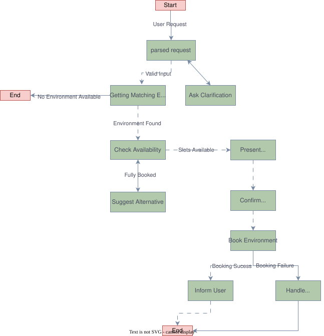
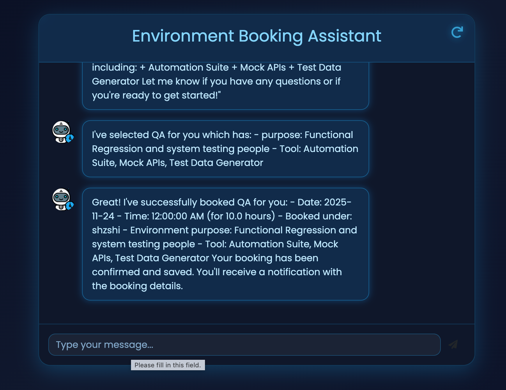

# Environment Booking AI Agent

An AI-powered agent that helps users search, select, and book Test Environments (Dev, QA, Performance, Release, etc.) using natural language.

Built with LangChain, LangGraph, and a fully interactive web UI.

### ⭐️ Features

🧠 LLM-based natural language understanding

🔍 Environment matching & ranking

📅 Availability checking

🏷️ Booking confirmation & conflict resolution

🔁 Clarification questions when information is missing

🖥️ Modern web chat interface with live conversation history

🧰 Extensible tool system for environment management

📘 System Flow Diagram

Use this diagram to understand how the agent processes a booking request.

## 🛠️ Tool Function Specifications

The agent uses several core tools to perform environment selection & booking.

### 1. find_matching_environments

Purpose:
Returns all environments that match the user’s requested type (dev/qa/perf/etc.).

Input:

{ "purpose": "development", "tools": ["jenkins"] }

Output:
List of matching environments.

### 2. check_availability_tool

Purpose:
Checks if an environment is available for a specified time window.

Input:

{
  "existing_bookings": [...],
  "environment_id": 3,
  "start_time": "2025-10-12T14:00:00",
  "duration_hours": 2
}

Output:
Boolean (“available” or “conflict”).

### 3. find_similar_environments_tool

Suggests alternative environments based on tool overlap + purpose similarity.

### 4. book_environment_tool

Purpose:
Writes a confirmed booking to the persistent store.

Input:

{
  "environment_id": 2,
  "start_time": "2025-10-12T13:00:00",
  "end_time": "2025-10-12T15:00:00",
  "user_name": "Shzshi"
}

Output:
Booking object (or null on failure).

### 5. save_bookings_tool

Low-level tool that actually writes bookings into storage (JSON file).

🖼️ UI Screenshots

## ⚙️ Local Development (via uv)

(brief as requested)

1. Install uv
pip install uv

2. Create environment
uv venv
source .venv/bin/activate

3. Install dependencies
uv pip install -r requirements.txt

4. Run the app
uv run run.py

## 📂 Project Structure
src/
  booking_agent/
    tools/
    schemas.py
    agent.py
    state_machine.py
static/
  style.css
  script.js
templates/
  index.html
data/
  environments.json
  bookings.json

## Roadmap / Future Improvements

- Add support for calendar integration (Google Calendar, Outlook)
- Use a database (PostgreSQL / SQLite) instead of JSON file
- Add authorization (who can book which environments)
- Enhance UX: show available slots, calendar UI
- Support recurring bookings
- Add notification: email or Slack on booking confirmation

### Contributing

I welcome contributions!
Please fork the repository
Create a feature branch (git checkout -b feature/your-feature)
Add tests & update documentation
Submit a pull request, and we’ll review ASAP

## Credits & Inspiration

This project was inspired by the excellent work in the  
[Meeting Room Booking AI Agent](https://github.com/danieladdisonorg/Meeting-Room-Booking-AI-Agent)  
created by **Daniel Addison**.

## License

MIT License — free for personal and commercial use.